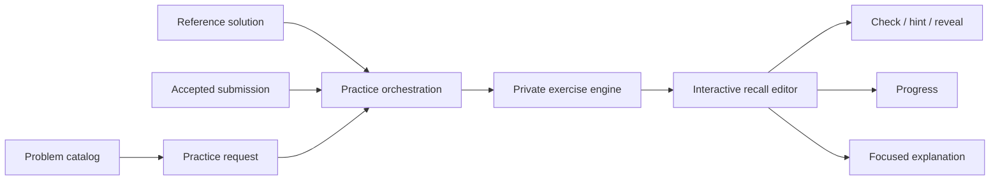

<div align="center">
  <a href="https://leetin.me">
    
  </a>

  <p><strong>Practice the code you want to remember.</strong></p>
  <p>Active-recall exercises for coding interview solutions.</p>

  <p>
    <a href="https://leetin.me"><strong>Try LeetIn</strong></a>
    ·
    <a href="docs/ARCHITECTURE.md">Architecture</a>
    ·
    <a href="docs/SHOWCASE-SCOPE.md">Showcase scope</a>
  </p>
</div>

> [!IMPORTANT]
> This repository is a public engineering showcase, not LeetIn's production source release. The production implementation, exercise-generation logic, answer-matching rules, prompts, integrations, data, and operational configuration remain private. The included code is a deliberately small, non-deployable architecture skeleton.

## Why LeetIn

Reading a solution can make it feel familiar. Writing it again reveals whether it is actually retrievable.

LeetIn turns coding solutions into interactive fill-in-the-blank exercises. Instead of passively rereading an answer, you reconstruct the important parts, check your recall, ask for a hint when you are stuck, and repeat until the pattern becomes yours.

## Product Experience

1. Choose a problem from a curated list or search the catalog.
2. Practice a reference solution in **Auto Mode**, or connect LeetCode and revisit one of your own accepted submissions in **Review Mode**.
3. Fill in the missing code at the difficulty level that fits the session.
4. Check answers, use hints, reveal the solution when needed, and finish the exercise.
5. Return later and use progress history to keep reviewing.

## Product Capabilities

| Capability | What it enables |
| --- | --- |
| Active-recall editor | Reconstruct selected parts of a solution instead of rereading the whole answer |
| Auto Mode | Start immediately with a reference solution |
| Review Mode | Practice from your own accepted LeetCode submission |
| Adjustable difficulty | Change how much of the solution must be recalled |
| Hints and answer reveal | Recover from a block without abandoning the exercise |
| Focused explanations | Select code lines and ask for a concise explanation of that section |
| Progress tracking | Keep attempts and completion state across practice sessions |
| Curated problem lists | Practice common interview sets and company-focused collections |
| Python, Java, and C++ | Review the same problem in the language you use for interviews |
| Guest-first experience | Try the core practice loop before connecting an account |

## How It Fits Together



The production application uses a Next.js App Router interface backed by server-side application services. A practice request selects a problem, language, mode, and difficulty. Orchestration resolves the appropriate solution source, then hands it to a private exercise engine. The resulting exercise is rendered in an interactive editor while progress and optional explanations remain separate concerns.

See [Architecture](docs/ARCHITECTURE.md) for the public system map and trust boundaries.

## Engineering Highlights

### Two paths into one practice loop

Auto Mode and Review Mode begin with different solution sources, but converge on one exercise contract. That keeps the editor consistent while allowing a learner to move between a clean reference implementation and code they previously wrote themselves.

### Core behavior behind an explicit boundary

The proprietary transformation engine is accessed through a narrow interface. UI, progress, and solution-source integrations depend on the exercise contract rather than the implementation that chooses blanks, constructs hints, or evaluates answers.

### Guest-first, account-enhanced design

The primary practice loop is available without an account. Connecting LeetCode adds access to personal accepted submissions and cross-device progress without turning authentication into the product's front door.

### Explanations scoped to the learner's question

Instead of generating a second full editorial, LeetIn lets the learner select the lines they want help with. The explanation path receives a bounded selection and returns a compact response designed to keep attention on the exercise.

### Clear client/server ownership

Browser interaction, server orchestration, external integrations, and persistence have explicit boundaries. Sensitive credentials and internal service details are not part of client-facing data contracts.

## Technology

- Next.js App Router, React, and TypeScript
- PostgreSQL with Prisma
- Server-side LeetCode integration for connected workflows
- OpenAI-compatible language-model services for selected assistive features
- Railway production deployment

Version numbers, providers, schemas, quotas, prompts, and deployment configuration are intentionally omitted from this public repository.

## Public Repository Layout

```text
leetin-public/
├── README.md
├── LICENSE.md
├── SECURITY.md
├── assets/
│   └── leetin-logo.svg
├── docs/
│   ├── ARCHITECTURE.md
│   └── SHOWCASE-SCOPE.md
├── src/
│   ├── core/
│   │   ├── contracts.ts
│   │   └── ports.ts
│   ├── workflows/
│   │   └── create-practice-session.ts
│   ├── app/                  # structure only
│   ├── components/           # structure only
│   └── server/               # private adapters omitted
└── tests/                    # production test suite omitted
```

The TypeScript files demonstrate dependency direction and public-facing domain vocabulary. They do not contain the production algorithms, adapters, routes, database models, prompts, or configuration required to run LeetIn.

## Explore the Skeleton

Start with [`src/core/contracts.ts`](src/core/contracts.ts) for the small public domain model, then read [`src/core/ports.ts`](src/core/ports.ts) and [`src/workflows/create-practice-session.ts`](src/workflows/create-practice-session.ts) to see how the application keeps proprietary behavior behind interfaces.

There is intentionally no install or deployment command. This repository cannot be used to build a working LeetIn instance.

## Source Availability

LeetIn is independently designed and operated. This repository documents the product and selected engineering patterns, but it is not an open-source distribution. No license is granted to copy, modify, distribute, deploy, or create derivative works from the included materials. See [LICENSE.md](LICENSE.md).

LeetIn is an independent product and is not affiliated with or endorsed by LeetCode.

---

<div align="center">
  <a href="https://leetin.me"><strong>leetin.me</strong></a>
</div>
