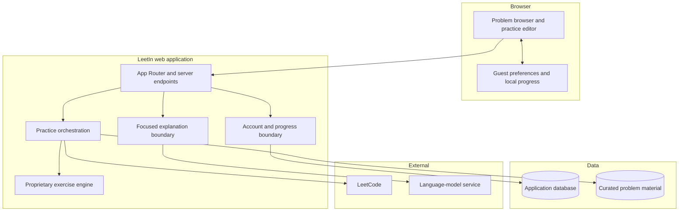
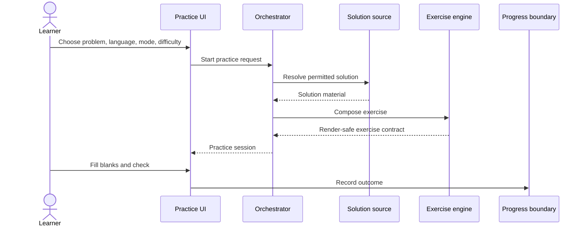

# Public Architecture Overview

This document describes LeetIn at the system-boundary level. It is intentionally useful for understanding the engineering shape of the product without disclosing the implementation that makes the product reproducible.

## System Map

## Main Responsibilities

| Boundary | Responsibility | Public showcase |
| --- | --- | --- |
| Product UI | Problem discovery, mode selection, practice interaction, and progress presentation | Described only |
| Practice orchestration | Validate a request, resolve a solution source, invoke the exercise engine | Small illustrative example |
| Exercise engine | Select recall targets, produce hints, normalize and evaluate answers | Interface only |
| Solution sources | Supply a reference solution or the learner's accepted submission | Interface only |
| Explanation boundary | Explain a bounded code selection in problem context | Interface only |
| Identity and progress | Associate practice history with a guest or connected learner | Described only |
| External adapters | Communicate with LeetCode and model providers | Omitted |
| Persistence | Store application state and reusable server-side material | Omitted |

## Practice Flow

Both product modes use the same high-level flow:

- **Auto Mode** resolves a reference solution.
- **Review Mode** resolves an accepted submission belonging to the connected learner.

The returned exercise contract is intentionally independent of the source. Source-specific authorization, retrieval, fallback behavior, and caching stay outside the editor.

## Trust Boundaries

- Treat browser state, route parameters, headers, and submitted answers as untrusted input.
- Keep privileged integrations and secrets in server-only modules.
- Return narrow data-transfer objects rather than persistence records.
- Re-check identity and resource ownership at every protected server entry point.
- Keep third-party credentials out of logs and durable application data unless explicitly required and protected.
- Bound expensive or model-backed operations with server-side policy.

These are architectural principles, not a disclosure of the production controls or their configuration.

## Deliberately Private

The following are product implementation, not showcase material:

- exercise transformation and blank-selection algorithms;
- answer normalization, equivalence, scoring, and retry behavior;
- hint construction and reveal policy;
- prompts, model routing, guardrails, and evaluation suites;
- LeetCode request details and session-handling implementation;
- database schema, migrations, caches, quotas, and abuse controls;
- curated datasets and generated solution material;
- analytics, observability, deployment, and incident procedures;
- production tests and internal quality thresholds.

The folder tree in this repository is conceptual and does not claim to mirror the production repository one-for-one.
